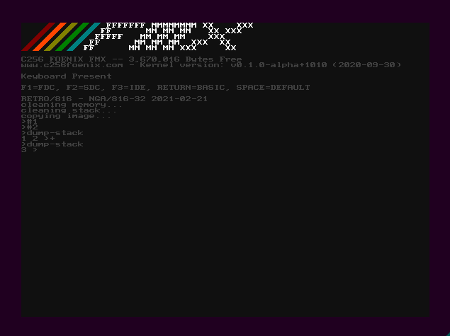

# retro/816
Port of [RETRO Forth](http://retroforth.org/) created
by [Charles Childers](https://www.patreon.com/_crc) to 
[C256 Foenix](https://c256foenix.com/), a retro-computer
based on 65c816 CPU.

This port is in infancy and there are dark and spooky things inside,
but at this moment is able to run simple code in 1:1 pair to one of
original interpreters (`vm/nga-c/barebones`).

It runs in [Foenix IDE](https://github.com/Trinity-11/FoenixIDE), 
it is also possible to run current, unmodified version of this 
port on [go65c816 emulator](https://github.com/aniou/go65c816) 
(use `retro.ini` parameters file here).

## obligatory screenshot
  
